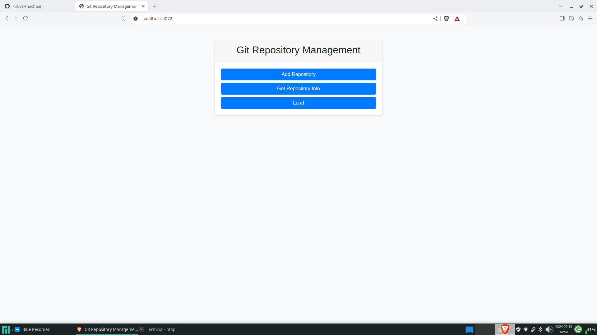
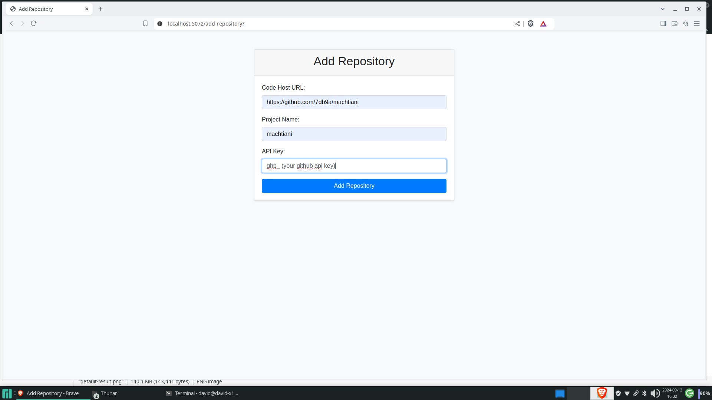
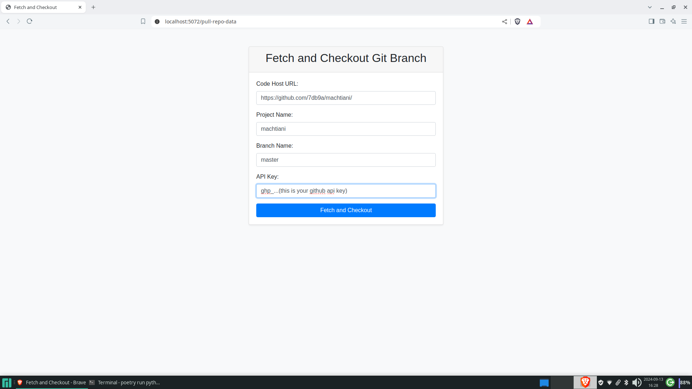
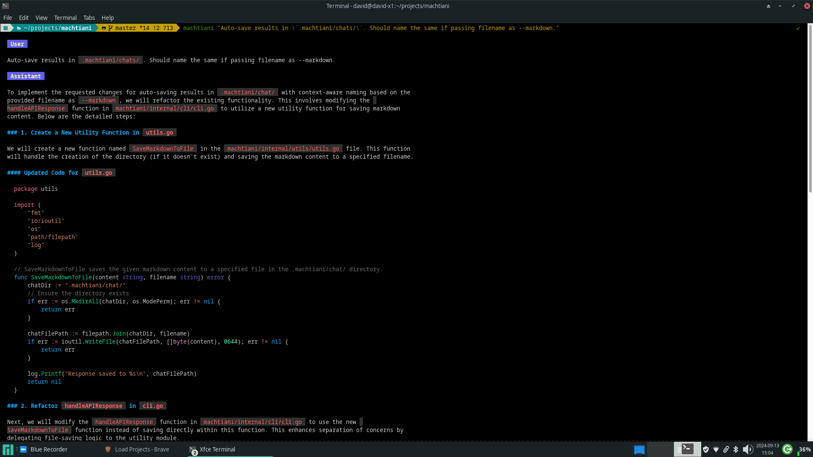
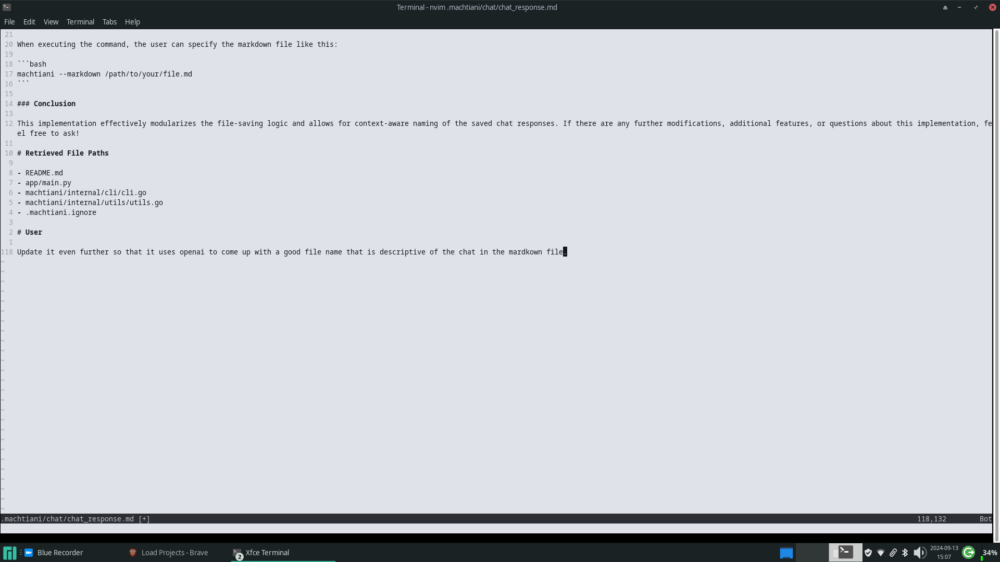

# machtiani

**Machtiani** is a command-line interface (CLI) tool designed to facilitate code chat and information retrieval from code repositories. It allows users to interact with their codebases by asking questions and retrieving relevant information from files in the project, utilizing language models for processing and generating responses. The aim is to support other models other than OpenAI, including open-source and self-hosted options.

It's very usable, but rough around the edges at the moment.

## Limitations

To fully utilize Machtiani for effective document retrieval, it is essential to have concise, informative, and atomic git commit messages. If your commit messages do not meet this criterion, we recommend using the CLI tool [aicommit](https://github.com/coder/aicommit), which is designed to assist in generating appropriate commit messages.

While I personally find Machtiani to be my go-to tool—over ChatGPT or any other alternatives—I primarily use it with codebases similar in size to this project.

Keep in mind that Machtiani by default uses OpenAI's gpt-4o-mini (optionally gpt-4o) API. So it incurs costs, and there is currently no cost estimator available. However, for a few hundred commits, users should find that the indexing of commit messages with OpenAI embeddings remains manageable.

## Upcoming Features to Look Forward To

- [ ] Optional support for 'libre' hosted version.
- [ ] Support open-source LLMs and other models (self-config).
- [ ] Add as a submodule `aicommit` to help generate better commit messages, and even rewrite commits to Machtiani standards.
- [ ] Cost management to how much it will cost to index.
- [ ] Improve handling of file path changes in version control systems.
- [ ] Auto-save results in `.machtiani/chat/` with context-aware naming.
- [ ] Enhance the user interface and experience.

## Quick Launch

1. Clone this project.

   ```bash
   git clone --recurse-submodules <repo-url>.git machtiani
   ```

2. Update the `machtiani-config.yml` file in the root of the `machtiani` directory with the following content:

   ```yaml
   environment:
     OPENAI_MACHTIANI_API_KEY: "your_openai_api_key"
     MACHTIANI_URL: "http://localhost:5071"  # or your desired API URL
     MACHTIANI_REPO_MANAGER_URL: "http://localhost:5070"
   ```

   Warning: If the `OPENAI_API_KEY` is set, please be aware that costs will be incurred for embedding the prompt using the OpenAI API.

   ***Also you'll have to add a .env do in `machtiani-commit-file-retrieval/`. See [Running the FastAPI Application](machtiani-commit-file-retrieval/README.md#running-the-fastapi-application).***

3. Launch the application in development (without the API Gateway):

   ```bash
   docker-compose up --build --remove-orphans
   ```

4. If you want to run the application in production (with the API Gateway), use the following command:

   ```bash
   docker-compose -f docker-compose.yml -f docker-compose.prod.yml up --build --remove-orphans
   ```

5. Build the Machtiani CLI in `machtiani/machtiani/`.

   ```bash
   go build -o machtiani ./cmd/machtiani
   ```

6. Copy the CLI to a path that works for you in `machtiani/machtiani/`.

   ```bash
   cp machtiani ~/.local/bin/
   ```

7. Build the `aicommit` binary in `machtiani/aicommmit/`.

   ```bash
   cd aicommmit
   go mod tidy
   go build -o machtiani-aicommit-binary ./cmd/aicommit
   ```

8. Move the binary to a directory in your PATH.

   ```bash
   mv machtiani-aicommit-binary ~/.local/bin/
   ```

9. Start the local web server in a new terminal in `machtiani/machtiani-commit-file-retrieval/`.

    ```bash
    poetry install
    poetry run python web/server.py
    ```

## Go to local homepage localhost:5072



## Add a repo

1. Add a repo:
   - 

2. Get the latest changes:

   Click on `Get Repo Info` on the homepage, and it will prefill the values you chose when adding the repo originally.

   - 

3. Load the updated repository:
   - 

## Updating the repo and index

After your project has new commits on GitHub, follow these steps to get updated repository information and load it:

1. Get the latest changes:
   - 

2. Load the updated repository:
   - 

## Go CLI Usage

### Overview

The `machtiani` CLI allows you to interact with the project through command-line parameters. You can provide a markdown file or a prompt directly via the command line, along with various options such as the project name, model type, match strength, and mode of operation.

### Command Structure

```bash
machtiani [flags] [prompt]
```

### Flags
- `-markdown string` (optional): Specify the path to a markdown file. If provided, the content of this file will be used as the prompt.
- `-project string` (optional): Name of the project. If not set, it will be fetched from git.
- `-model string` (optional): Model to use. Options include `gpt-4o` or `gpt-4o-mini`. Default is `gpt-4o-mini`.
- `-match-strength string` (optional): Match strength options are `high`, `mid`, or `low`. Default is `mid`.
- `-mode string` (optional): Search mode, which can be `pure-chat`, `commit`, or `super`. Default is `commit`.

### Example Usage

1. **Providing a direct prompt:**

   ```bash
   machtiani "Auto-save results in .machtiani/chat/. Should name the same if passing filename as --markdown."
   ```

   How the output looks like
   - 

2. **Using an existing markdown chat file:**
   ```bash
   machtiani -markdown path/to/your/file.md
   ```

   Remember, the file has to end with a

   ```
   # User

   Your new prompt instructions
   ```
   - 

3. **Specifying additional parameters:**

Just a sample of the options.

   ```bash
   machtiani "Add a new endpoint to get stats." --model gpt-4o --mode pure-chat --match-strength high
   ```

4. **Chat mode**

   ```bash
   machtiani --markdown path/to/your/file.md --mode pure-chat
   ```

   This won't retrieve any files with this flag.

### Different modes

In the last example, you can don't have to select `pure-chat` to have a conversation with a markdown file

You could have run the command as

```
machtiani --markdown /tmp/response2567089509/response.md
```

without the `--mode pure-chat` as originally.

```
machtiani --markdown /tmp/response2567089509/response.md --mode pure-chat
```

If you don't select `--mode`, it's the same as `--mode commit`, where it searches commits for possible files to help answer the prompt.

### Store and sync repos

The `git-store` command allows you to add a repository to the Machtiani system.

**Usage:**
```bash
machtiani git-store --code-url <repository-url> --name <project-name> --code-api-key <api-key>
```

- `--code-url`: URL of the code repository.
- `--name`: Project name.
- `--code-api-key`: API key for the code repository (e.g., GitHub key).

**Example:**
```bash
machtiani git-store --code-url https://github.com/yourusername/yourrepo.git --name yourproject --code-api-key your_api_key
```

#### `git-sync`

The `git-sync` command is used to fetch and checkout a specific branch of the repository.

**Usage:**
```bash
machtiani git-sync --code-url <repository-url> --name <project-name> --branch-name <branch-name> --code-api-key <api-key>
```

- `--code-url`: URL of the code repository.
- `--name`: Project name.
- `--branch-name`: Branch name to checkout.
- `--code-api-key`: API key for the code repository (e.g., GitHub key).

**Example:**
```bash
machtiani git-sync --code-url https://github.com/yourusername/yourrepo.git --name yourproject --branch-name main --code-api-key your_api_key
```

### Ignoring Files with `.machtiani.ignore`

You'll have to ignore any binary files, providing the full path, such as images, etc.

To exclude specific files from being processed by the application, you can create a `.machtiani.ignore` file in the root of your project directory. The files listed in this file will be ignored during the retrieval process.

#### Example `.machtiani.ignore` file:
```
poetry.lock
go.sum
go.mod
```

### Output

The CLI will print the response received and save the output to a temporary markdown file, which will be displayed in the terminal.

## API Usage

After launch, you can access Machtiani's only endpoint [generate-response](http://localhost:5071/docs#/default/generate_response_generate_response_post) for interacting with the application programmatically.

## Conclusion

This web tool simplifies managing Git repositories through a user-friendly interface, utilizing a FastAPI backend for various tasks like loading projects, adding repositories, fetching project information, and checking out branches.

## Todo

- [x] Retrieve file content and add to prompt.
- [x] Get on UI is temperamental; if the wrong URL and token are given, it will mess up. Maybe all that should be done strictly on the commit-file-retrieval server side, the URL and token just pass the project name.
- [x] Separate command for sending edited markdown (don't wrap # User) (completed with commit 5a69231d4b48b6cd8c1b1e3b54a1b57c3d295a74).
- [x] Return list of files used in response with `--mode commit`.
- [x] machtiani.ignore.
- [x] Improve style and organization of web UI. Add links to fetch, add, and load on home page.
- [x] Break up main.go into a well-organized Go project file structure.
- [x] commit-file-retrieval can't handle gpt-4o (i.e., `Unprocessable Entity`).
- [x] commit-file-retrieval doesn't say there are no files to retrieve if it's found, but doesn't exist in the file.
- [x] CLI user should be warned if there are no retrieved files, with a suggestion to lower match-strength.
- [x] Add as submodule [aicommit](https://github.com/coder/aicommit)
- [x] Calculate and cap token usage.
- [ ] In commit-file-retrieval, get the most recent path (in case of name change) from git of a file and only use that.
- [ ] Script to rewrite a project's git commit history.
- [x] Auto-save results in `.machtiani/chat/`. Should name the same if passing filename as --markdown.
- [x] Markdown generated chats should automatically save and have an auto-generate context-aware name.
- [x] Content argument for mode flag should be `pure-chat`.
- [ ] Hide excessive stdout behind specific logging mode in commit-file-retrieval.
- [x] Modify cli so that it can generate embeddings for the original prompt the user creates, then pass it as a parameter to the generate-response endpoint.
- [ ] Chunk retrieval response by order of ranking according to token cap.
- [ ] Widdle down strategy, sub-prompt to ask to only keep the code files possibly related to the prompt?
- [ ] Implement filebot sum strategy - create a --mode super?
- [ ] A --search-web option
- [ ] Make serviceable
      - [x] Add machtiani commands for `add repo`, `fetch and update` and `load`
      - [x] `git-sync` code-host-url is sensitive to `/` (must) at end of url. Oddly `git-store` works just fine without.
      - [x] Keep it simple: each user will be able to add any repo, and we store git key. Fetch and update. And load
      - [x] See from there, and just get the endpoint up.
      - [x] Get codehost keys for git-store and git-sync commands from machtiani-config.yml. Get rid of passing them as arguments to the commands.
      - [x] All openai or other llm keys are passed via the machtiani-config.yml.
- [x] Get codehost key and urls from .machtiani.config.
